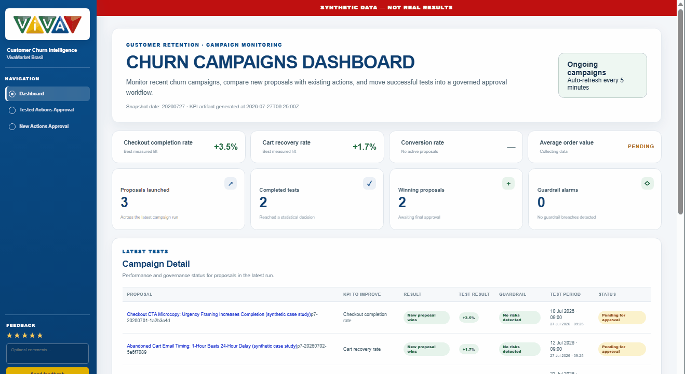
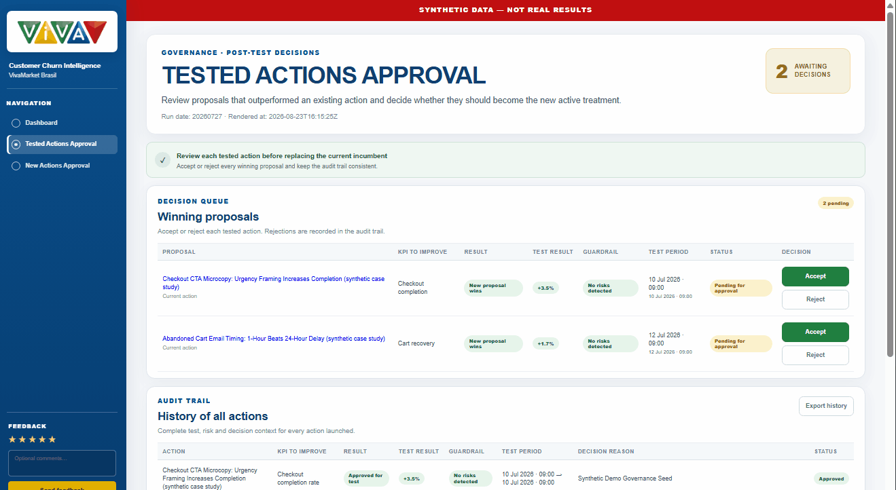
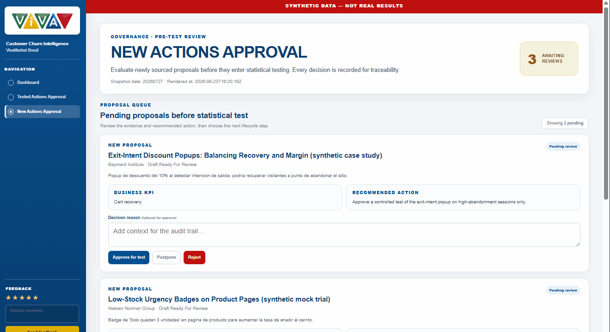

# Customer Churn Intelligence System

**VivaMarket Brasil — Governed Churn Intelligence System · Reproducible Portfolio Release**

[](https://www.python.org/)
[](https://www.postgresql.org/)
[](https://scikit-learn.org/)
[](https://fastapi.tiangolo.com/)
[](https://www.docker.com/)
[](LICENSE)
[](#development-methodology)

> **Verification at a glance**
> - Clean-source validation in a controlled local sandbox: `CLEAN_SOURCE_REPRODUCIBILITY=PASS` (run `churn-clean-source-20260919-091935`, 2026-09-19, executed by the Project Author; [evidence](reports/reproducibility/CLEAN_SOURCE_SANDBOX_EVIDENCE_20260919.md)).
> - Clean-room test suite: 158 passed ([evidence](reports/reproducibility/04_cp4_cleanroom_attempt_20260811.md)).
> - External Docker validation: verified ([status](reports/reproducibility/CP5_EXTERNAL_VALIDATION_STATUS.md)).
> - Fresh-checkout CI workflow: included in the project and backed by locally validated test, Docker and end-to-end reproducibility checks; see `.github/workflows/ci-reproducibility.yml`.
>
> Scope, dates and limits of each check are in [Reproducibility Status](#reproducibility-status).

---

## Executive Summary

VivaMarket Churn Intelligence System is a business-oriented data science project built around a recurring retention problem:

Who should receive limited retention attention, why, what should we do, did it work, and what should we try next?

The project began with churn prediction, but prediction alone does not resolve the business decision. A retention team also needs to understand the drivers behind risk, translate them into actions, measure whether those actions improve the intended KPI without unacceptable side effects, and preserve what was learned so the next decision is better informed.

The current system connects that full decision cycle:

DETECT → EXPLAIN → ACT → MEASURE → REACT → LEARN

### What the system supports

- Prioritize customers where modeled churn risk is most concentrated.
- Explain the behavioral drivers behind that prioritization.
- Act through differentiated, reviewable retention interventions.
- Measure each tested intervention against a primary business KPI and explicit guardrails.
- Decide whether an action should be approved, postponed or rejected.
- REACT by using accumulated internal evidence plus trusted external sources to propose the next candidate actions.
- Learn by preserving experiment results, decisions and rationale as reusable evidence.

The model is therefore one component of a broader business decision system rather than the final product.

### Decision evidence

The analytical layer demonstrates useful prioritization capacity:

- Precision@Top 5%: 1.0000
- Precision@Top 10%: ~0.9970
- ROC AUC: ~0.8016

These metrics are interpreted as ranking evidence: they support focusing limited retention capacity on the customers with the highest modeled risk. They are not presented as proof of business impact.

Retention actions are evaluated separately through:

- a primary KPI such as conversion or incremental observed response where applicable;
- guardrails that prevent a headline KPI improvement from masking unacceptable side effects;
- a statistical verdict;
- and a human-governed business decision.

The current intervention and measurement evidence is synthetic by design. The repository therefore demonstrates the decision framework and its technical implementation, while keeping the evidence boundary explicit.

### What REACT adds

REACT closes the loop between one experiment and the next.

It combines:

1. internal evidence — completed experiments, KPI results, guardrails, decisions and retained history;
2. trusted external evidence — governed sources used to identify plausible next interventions; and
3. human review — consequential decisions remain subject to approval before testing or adoption.

The result is not an autonomous retention engine. It is a governed system designed to help a CRM or retention decision-maker move repeatedly from evidence to action and back to evidence.

### What is demonstrated — and what is not

Demonstrated in the public portfolio release

- churn-risk prioritization and explainability;
- retention-action generation and orchestration;
- KPI and guardrail-based experimentation;
- governed post-test decisions;
- evidence-backed generation of new candidate actions;
- decision history and continuous-learning logic;
- reproducible FastAPI/Uvicorn + Nginx application runtime;
- synthetic demo and validation evidence.

Requires real-world validation

- observed real-customer causal uplift;
- validated production retention ROI;
- enterprise-scale production operations;
- uplift / incremental-response modeling.

For a faster business-oriented overview:

- [Executive Summary — 2 pages](reports/vivamarket_churn_intelligence_executive_summary.pdf)
- [Business Deck](reports/vivamarket_churn_intelligence_business_deck.pptx)

The repository itself remains the long-form technical and analytical record of how the system was developed, tested and evolved.

## Live UI Demo

The three implemented surfaces follow the business decision cycle rather than exposing three disconnected dashboards.

### Churn Campaigns Dashboard — What is happening?

The dashboard gives the retention decision-maker a consolidated view of active and historical actions:

- campaign status;
- primary KPI context;
- test results;
- guardrails;
- decision status;
- retained action history.

Its purpose is not simply to report model scores. It provides the measurement layer needed to understand which retention actions are generating usable evidence.



### Tested Actions Approval — What should we decide?

Once an action has been tested, the system brings together the evidence needed for a governed decision:

- primary KPI result;
- statistical test result;
- guardrail status;
- recommended decision;
- decision rationale;
- retained history.

The business approver can then Approve, Postpone or Reject the action rather than allowing statistical output alone to become a business decision.



### New Actions Approval — What should we try next?

The new-actions surface closes the learning loop.

It combines accumulated internal evidence with trusted external sources to generate candidate retention actions for the next test cycle. Each proposal remains reviewable before experimentation.

This is the implemented REACT capability:

evidence → candidate action → human review → experiment → decision → new evidence



### From dashboard to business learning loop

Together, the three surfaces implement:

MEASURE → DECIDE → REACT → TEST AGAIN

The visuals above come from the implemented product. Mockup source files and intermediate UI review artifacts are not part of the public release.

## Table of Contents

- [Executive Summary](#executive-summary)
- [Live UI Demo](#live-ui-demo)
- [Quick Start Docker (BYOK required for operator AI only)](#quick-start-docker-byok-required-for-operator-ai-only)
- [How to Bring Your Own Key](#how-to-bring-your-own-key)
- [Cost and Limits Notice](#cost-and-limits-notice)
- [No-Network Mocks Are Only for CI and Tests](#no-network-mocks-are-only-for-ci-and-tests)
- [Architecture](#architecture)
- [Metrics and Limitations](#metrics-and-limitations)
- [Reproducibility Status](#reproducibility-status)
- [Development Methodology](#development-methodology)
- [Project Context](#project-context)
- [Business Problem](#business-problem)
- [Methodology](#methodology)
- [Modeling Approach](#modeling-approach)
- [Project Evolution](#project-evolution)
- [Results & Performance](#results--performance)
- [Phase 5 — Retention Intervention Validation Framework](#phase-5--retention-intervention-validation-framework)
- [Phase 6 — Dynamic Evidence System](#phase-6--dynamic-evidence-system)
- [Phase 7 — Governed Churn Intelligence & Continuous Retention Learning](#phase-7--governed-churn-intelligence--continuous-retention-learning)
- [System Architecture](#system-architecture)
- [Notebook Pipeline Reference](#notebook-pipeline-reference)
- [Main Deliverables](#main-deliverables)
- [File Structure](#file-structure)
- [Technical Stack](#technical-stack)
- [Methodological Notes](#methodological-notes)
- [Known Limitations](#known-limitations)
- [Professional Improvement Roadmap](#professional-improvement-roadmap)
- [Future Work](#future-work)
- [Version Note](#version-note)
- [License & Contact](#license--contact)

---


## Quick Start Docker (BYOK required for operator AI only)

```bash
git clone https://github.com/albertosvallejo/customer-churn-intelligence-system.git
cd customer-churn-intelligence-system
cp .env.example .env
# Public synthetic dashboard works without a key.
# Only operator-side LLM features require your own key in .env.
docker compose up --build
# Dashboard: http://localhost:8080/customer-churn/dashboard
# API docs:  http://localhost:8080/docs
```

### What this quick start currently proves

- the package has already been curated as a reproducible portfolio release;
- external Docker validation has already been demonstrated through the public evidence bundle;
- the public dashboard and governed review routes are documented as part of the same public runtime line; and
- the release package is aligned with the curated public evidence and manifests shipped in this repository.

### Reproducibility validation

Reproducibility is evidenced at two levels:

1. **Clean-source validation in a controlled local sandbox (before publication).** The Project Author ran a clean-source validation independently of GitHub: run `churn-clean-source-20260919-091935`, `CLEAN_SOURCE_REPRODUCIBILITY=PASS`, with no project fixes applied. It was executed on 2026-09-19 against the source as it stood on that date. It is the author's own run, so it is supporting evidence rather than an independent audit. See the [evidence summary](reports/reproducibility/CLEAN_SOURCE_SANDBOX_EVIDENCE_20260919.md), including the pack's stage-by-stage results and SHA-256 manifest.
2. **Fresh-checkout CI workflow.** Included in the project and backed by locally validated test, Docker and end-to-end reproducibility checks. See the workflow described below.

**Release integrity / manifest-controlled package validation** complements that evidence for the curated public release contents.

`.github/workflows/ci-reproducibility.yml` automates the same validation chain for a fresh checkout of the published repository:

fresh checkout
→ secret scan
→ tests
→ Docker build
→ startup
→ health
→ HTTP smoke
→ shutdown

### What this quick start does **not** claim

- it does not claim live production cutover or staging deployment;
- it does not claim that a container image has been published to a registry (GHCR); the supported path is building from source with `docker compose up --build`; and
- it does not depend on any private operational documentation to understand the public release contract.

## How to Bring Your Own Key

The project follows a strict **BYOK** rule for LLM-capable operator flows.

1. Copy `.env.example` to `.env`.
2. Keep public demo mode available with:
   - `MODE=synthetic_demo`
   - `LLM_MODE=disabled`
3. Only if you want operator-side AI behavior, set in `.env`:

```env
LLM_MODE=live
OPENAI_API_KEY=your-own-key-here
PHASE7_LLM_PROVIDER=openai
PHASE7_OPENAI_MODEL=<supported-model>
PHASE7_OPENAI_REASONING_EFFORT=medium
PHASE7_OPENAI_TEMPERATURE=
```

Rules enforced by the documented release policy:

- the public synthetic dashboard does not require an OpenAI key;
- the real key is written only in `.env`, never in `.env.example`;
- the key must remain outside Git;
- the browser must never receive the OpenAI key directly;
- CI/tests use mocks without network, not hidden shared credentials.

See also: [SECURITY.md](SECURITY.md).

---

## Cost and Limits Notice

- The public synthetic dashboard is keyless and should not incur LLM cost.
- Any operator-side LLM usage is paid by the person who enables `LLM_MODE=live` with their own key.
- The public security and reproducibility policies treat live LLM use as opt-in and bounded.
- The documented clean-room strategy allows only limited live verification when needed, with explicit operator consent and without capturing the secret in transcripts.

Current non-secret operator-side knobs already exposed in `.env.example` include:

- `PHASE7_LLM_PROVIDER=openai`
- `PHASE7_OPENAI_MODEL=`
- `PHASE7_OPENAI_REASONING_EFFORT=medium`
- `PHASE7_OPENAI_TEMPERATURE=`

---

## No-Network Mocks Are Only for CI and Tests

This repository separates three states clearly:

1. **Public demo state** → real packaged UI/API over synthetic versioned artifacts.
2. **Operator live state** → same runtime, but with BYOK enabled for LLM-capable paths.
3. **CI / test state** → mocked or synthetic validation paths with no external network requirement.

CI and tests are not presented here as a functional alternative to the product demo. They exist to validate contracts, auth, reproducibility, and failure handling without secrets or external calls.

Evidence already captured:

- local full green suite from clean-room copy (`158 passed`) in `04_cp4_cleanroom_attempt_20260811.md`;
- focused Phase 7 suite green after auth-test realignment, reflected in the public reproducibility bundle.

---

## Architecture

### Runtime shape for the reproducible release line

- **web**: Nginx container serving the public dashboard and governance entry routes
- **api**: FastAPI/Uvicorn application as the only publishable HTTP application runtime
- **synthetic evidence bundle**: versioned public artifacts that support the reproducible demo and governance surfaces
- **evidence/recommendation layer**: deterministic synthetic bundle + evidence builders + governed recommendation logic
- **optional ops-db**: retained only for compatibility contexts, not required for the first public synthetic release baseline

### Main business routes

- `/customer-churn/dashboard`
- `/customer-churn/dashboard/data`
- `/customer-churn/new-actions-testing`
- `/customer-churn/new-actions-testing/data`
- `/customer-churn/tested-actions-approval`
- `/customer-churn/tested-actions-approval/data`
- protected write paths under `/phase7/...`

### Business learning loop

```text
MODEL / RISK
↓
EXPLAIN
↓
ACTION
↓
MEASURE
↓
GOVERNED DECISION
↓
REACT
↓
NEXT ACTION
```

This business loop coexists with the historical analytical notebook pipeline. The repository therefore contains both:

1. the **analytical pipeline** (`NB01 → NB09`); and
2. the **business learning loop** that turns evidence into governed action decisions.

### Key architecture decisions already evidenced

- FastAPI/Uvicorn replaced the legacy HTTP entrypoint for the public reproducible API line.
- Nginx remains the public web layer.
- The public demo is driven by versioned synthetic artifacts, not by hidden live customer data.
- Sensitive decisions remain governed by explicit approval surfaces and decision history.
- LLM-sensitive logic remains server-side and BYOK-only.
- n8n remains the internal orchestration platform in the broader project history, while the public package centers on the reproducible HTTP runtime plus evidence bundle.

See also:

- [DEPLOYMENT.md](docs/deployment/DEPLOYMENT.md)
- [REPRODUCIBILITY.md](docs/reproducibility/REPRODUCIBILITY.md)
- [docs/adr/ADR-001-reproducible-deployment.md](docs/adr/ADR-001-reproducible-deployment.md)
- Public release contract: repository root + `Dockerfile.api` + `Dockerfile.web` + `docker-compose.yml` + `.env.example`

## Metrics and Limitations

### Verified strengths

- Public dashboard route validated through the curated reproducible line.
- Token-gated operator reads/writes validated through smoke tests and contract/integration suites.
- Synthetic bundle determinism bug in Phase 7 was detected with real evidence and corrected with strict rebuild proof.
- External Docker validation already exists for the current curated release package.
- Governed post-test and new-action review surfaces are now part of the documented closed system scope.

### Important limitations kept explicit

- The public release demonstrates a governed synthetic learning loop, not real-customer causal uplift.
- Production retention ROI is not claimed as validated.
- Enterprise-scale production operations are outside the demonstrated scope.
- The analytical and portfolio evidence remain intentionally separated from private operational traceability.
- Clean-source reproducibility was verified before publication through a controlled local sandbox runner (run `churn-clean-source-20260919-091935`, 2026-09-19), which is the Project Author's own run. The complementary clean-checkout CI workflow is included in the project and backed by locally validated test, Docker and end-to-end reproducibility checks (see `.github/workflows/ci-reproducibility.yml`).
- External evidence coverage is intentionally pilot-scoped. The REACT capability currently uses validated free-access external sources; broader production retrieval would normally integrate paid research/search or retrieval services where justified by the business case.
- Enterprise identity and access management are outside the pilot scope. Baseline safeguards are implemented, but production-grade IAM, RBAC, SSO, enterprise audit controls and broader organizational security hardening are not part of the current portfolio implementation.

## Reproducibility Status

| Area | Current status | Evidence |
|:-----|:---------------|:---------|
| Public HTTP runtime consolidation | Complete | `Dockerfile.api`, `Dockerfile.web`, `docker-compose.yml`, `docs/reproducibility/REPRODUCIBILITY.md` |
| Clean-room reproducibility | Verified | `reports/reproducibility/04_cp4_cleanroom_attempt_20260811.md` |
| External Docker validation | Verified | `reports/reproducibility/CP5_EXTERNAL_VALIDATION_EVIDENCE.txt`, `reports/reproducibility/CP5_EXTERNAL_VALIDATION_STATUS.md` |
| Phase 7 reporting/governance surfaces | VERIFIED / CLOSED | pilot GIFs, browser-smoke captures, `src/api/phase7_reporting_page.py`, `src/api/phase7_review_page.py`, `web/templates/*` |
| Phase 7 synthetic determinism | Verified | `docs/reproducibility/REPRODUCIBILITY.md`, public synthetic manifests |
| Clean-source reproducibility (local sandbox) | VERIFIED | controlled local sandbox validation run `churn-clean-source-20260919-091935` (clean-source job, no project fixes applied, 2026-09-19) — the Project Author's own pre-publication run, independent of GitHub Actions; not re-executable from this repository alone; see `reports/reproducibility/CLEAN_SOURCE_SANDBOX_EVIDENCE_20260919.md` |
| Release curation | PASS | manifest-controlled public package + curated release copy |
| GitHub Actions clean-checkout CI | Defined and locally validated by supporting evidence | `.github/workflows/ci-reproducibility.yml` defines the fresh-checkout validation flow; its test, Docker and end-to-end reproducibility stages are backed by local validation evidence |
| Real-customer business validation | Not claimed | outside the demonstrated public scope |

### Documentation bundle for this phase

- [REPRODUCIBILITY.md](docs/reproducibility/REPRODUCIBILITY.md)
- [DEPLOYMENT.md](docs/deployment/DEPLOYMENT.md)
- [SECURITY.md](SECURITY.md)
- [CHANGELOG.md](CHANGELOG.md)
- [CLEANROOM_EVIDENCE_TABLE.md](docs/reproducibility/CLEANROOM_EVIDENCE_TABLE.md)
- [docs/adr/ADR-001-reproducible-deployment.md](docs/adr/ADR-001-reproducible-deployment.md)

### Selected Public Evidence

The repository intentionally includes a **small curated evidence set** so the project can be evaluated without running the full stack. That is an explicit Project Author decision, not an accidental subset.

Highlighted public evidence:

- [Dataset checksum](docs/DATASET_SOURCE_CHECKSUM_CANONICAL.md)
- [Model card](reports/model_card_v3_phase4_demo_20260531.md)
- [Synthetic demo manifest](data/synthetic_demo/synthetic_demo__phase7_manifest_20260727.json)
- [Synthetic integrated action output](reports/synthetic_demo/synthetic_demo__phase7_integrated_actions_20260727.md)
- [Clean-room evidence](reports/reproducibility/04_cp4_cleanroom_attempt_20260811.md)
- [Clean-source sandbox evidence](reports/reproducibility/CLEAN_SOURCE_SANDBOX_EVIDENCE_20260919.md) (summary; raw pack at `reports/reproducibility/sandbox-evidence/churn-clean-source-20260919-091935/`)
- [External validation status](reports/reproducibility/CP5_EXTERNAL_VALIDATION_STATUS.md)
- [External validation evidence](reports/reproducibility/CP5_EXTERNAL_VALIDATION_EVIDENCE.txt)
- [Executive Summary](reports/vivamarket_churn_intelligence_executive_summary.pdf)
- [Business Deck](reports/vivamarket_churn_intelligence_business_deck.pptx)
- [Pilot dashboard GIF](assets/images/01_pilot_dashboard.gif)
- [Tested Actions GIF](assets/images/02_pilot_tested_actions.gif)
- [New Actions GIF](assets/images/03_pilot_new_actions.gif)

## Development Methodology

This repository was built as a **Spec-Driven Data Science project with OpenClaw agent support and explicit human supervision**.

**Spec-Driven** means every notebook was defined analytically before being built — inputs, outputs, transformations, and validation criteria were specified explicitly before any code was written. This reduces scope drift, makes QA tractable notebook by notebook, and produces artifacts whose lineage is traceable across the full pipeline.

**OpenClaw** is the execution environment and agent runtime used to execute and iterate on notebooks inside a structured workspace. It acts as the execution layer — running code, surfacing errors, and generating outputs — while analytical decisions, validations, and direction changes remain under human control.

**Human supervision** means no output was accepted without review. Every notebook's results were inspected against the spec before the next step was started. The agent accelerates execution; the human owns the analytical decisions.

### The Architect (v1)

The Spec-Driven workflow in this project was developed using **The Architect**, a personal **Spec-Driven Data Science agent/workflow** (v1) created specifically to structure data science work from analytical specification through to operational delivery.

A few honest notes about The Architect v1:

- It is a **personal agent/workflow**, not a published product. v1 was built and battle-tested for the first time on this project.
- It combines agent-assisted execution with explicit workflow discipline: specification first, controlled execution second, human review before progression.
- It runs with **OpenClaw agent support** and explicit human supervision rather than as a fully autonomous system.
- It will **evolve with each new project** as new DS execution patterns, QA needs, and operational edge cases emerge.

The result is a working style that emphasizes structured execution, notebook-by-notebook QA, operational traceability, reproducibility, and business-facing deliverables that can evolve cleanly across versions.

---

## Project Context

### Why build a churn intelligence system for a marketplace?

Marketplace retention starts with a modeling problem, but it does not end there.

Unlike subscription businesses, marketplaces have no explicit cancellation event. The population boundary is blurry, repurchase cadence is irregular, and many customers buy once and never return. "Inactive for 90 days" can therefore describe very different customer behaviors.

That makes churn prediction itself difficult — but prediction only answers the first business question:

Who should receive retention attention?

A CRM or retention team still needs to answer:

- Why is this customer considered at risk?
- Which intervention is appropriate?
- Which channel or incentive should be tested?
- What business KPI should determine whether the intervention worked?
- Did the action create unacceptable side effects?
- Should the result be approved, postponed or rejected?
- What should be tested next?
- What has the organization learned from previous decisions?

This project evolved around that broader problem.

The initial analytical work focused on defining and predicting churn correctly in a marketplace context. Later phases progressively added explainability, operational actioning, orchestration, campaign measurement, experimental validation, dynamic evidence, governed decisions and finally the REACT learning loop.

The result is therefore better described as a churn intelligence and retention decision system than as a churn model in isolation.

### The underlying analytical challenge

Churn prediction in subscription businesses is comparatively clean: the event is defined (cancellation), the population is clear (active subscribers), and the label is explicit.

Marketplace churn is much harder.

There is no cancellation event. The population boundary is blurry. Most customers in many cohorts bought once and never returned, which may be normal behavior rather than churn. And "inactive for 90 days" means something very different for a customer with seven orders over two years than for a customer with a single purchase.

The dataset reflects realistic marketplace dynamics, and the challenges it presents — one-time-buyer dominance, irregular interpurchase intervals, label leakage risk in temporal splits, and the difficulty of defining a truly retainable population — are the same types of analytical challenges faced by marketplace retention teams.

The v1 baseline established a working end-to-end prediction system. Its limitations then became evidence for the V2C redesign and for the broader evolution of the project from prediction toward governed retention decision-making.

### Project background

This is a personal deep-dive project built after completing a Master's in Data Science to develop hands-on experience with business-oriented, production-aware data science in a realistic ecommerce setting.

The goal was deliberately broader than maximizing a model metric.

The project explores how analytical work moves from:

business problem definition
→ modeling
→ explainability
→ operational action
→ measurement
→ governed decision
→ learning

while keeping technical reproducibility and evidence boundaries explicit.

That progression is also why the project retains its development history: several of the most important improvements came from findings that changed the business framing of the problem rather than from model tuning alone.

### Business Context

VivaMarket Brasil is a marketplace-style ecommerce platform with a transactional customer base that purchases irregularly across multiple product categories.

The target user is a CRM / Retention Manager or analyst operating with limited retention capacity and needing to decide:

- which customers warrant attention;
- what intervention is worth testing;
- whether the intervention worked;
- whether the result is safe enough to act on;
- and what should be tried next.

The system is designed around supporting that decision cycle.

## Business Problem

### Challenge Statement

The project addresses a retention decision problem rather than a prediction problem alone.

A marketplace retention team has limited capacity, uncertain customer intent and no explicit churn event. It therefore needs a system that can move from imperfect behavioral evidence to controlled, measurable actions.

Six challenges are interconnected:

1. Define who is genuinely retainable.
One-time buyers dominate many marketplace populations. Treating every inactive customer as equivalent can waste retention capacity and distort the learning problem.

2. Prioritize limited retention attention.
The model must rank customers usefully enough that CRM capacity can focus on the highest-risk portion of the eligible population.

3. Explain why the customer is prioritized.
A risk score alone is insufficient for action. Behavioral drivers need to be interpretable enough to inform treatment choice.

4. Translate risk into testable retention actions.
Recommendations must become explicit treatments — copy, channel, timing or incentive — that can be reviewed, orchestrated and measured.

5. Decide whether an action actually worked.
A retention action must be evaluated against a primary KPI while guardrails protect against unacceptable side effects. "Winner", "no effect" and "insufficient signal" must all remain valid outcomes.

6. Turn evidence into the next decision.
Experiment results should not disappear into static reports. The system should retain decisions and use accumulated evidence to identify what is worth testing next.

Together these challenges define the project's business loop:

DETECT → EXPLAIN → ACT → MEASURE → REACT → LEARN

### Core Questions

1. Who should we prioritize for retention?
2. Why is each prioritized customer at risk?
3. What retention action should we take or test?
4. Did the action improve its primary KPI without breaking relevant guardrails?
5. Should the evidence lead us to approve, postpone or reject the action?
6. What should we try next based on what we have learned?

### Success Criteria

The project separates analytical success from business-decision usefulness.

#### Analytical quality

- temporally valid customer snapshots and churn labels;
- reproducible NB01 → NB09 analytical pipeline;
- ranking quality suitable for prioritization;
- explainability outputs that map model behavior to interpretable drivers;
- explicit calibration and population-design limitations.

#### Business decision quality

- limited retention capacity can be focused on a prioritized customer population;
- risk is translated into differentiated retention actions;
- every tested action is associated with a primary KPI;
- guardrails prevent KPI-only decision-making;
- insufficient evidence remains a valid outcome;
- consequential decisions remain human-governed;
- test results and decisions are retained as history;
- accumulated evidence can produce reviewable next-action proposals.

#### Operational quality

- scoring and action payloads can be orchestrated;
- n8n workflows demonstrate end-to-end internal operational execution;
- public dashboard and governance surfaces expose the decision workflow;
- the application can run over a reproducible synthetic evidence package;
- protected operations remain separated from public read-only access.

#### Evidence quality

- model metrics are not presented as business-impact metrics;
- synthetic intervention evidence is labeled as synthetic;
- real-customer causal uplift is not claimed without a real pilot;
- production ROI is not inferred from scenario results;
- limitations and accepted residuals remain documented rather than hidden.

#### Communication quality

- a business stakeholder can understand:
  - who the system prioritizes;
  - why;
  - what action is proposed;
  - how success is measured;
  - where human governance applies;
  - and what evidence suggests doing next;
- technical evidence remains available for deeper review;
- the Executive Summary and Business Deck provide shorter entry points for non-technical evaluation.

## Methodology

### End-to-End Flow

```text
Raw SQLite data
→ data cleaning + churn-oriented EDA
→ repeated customer snapshot engineering
→ temporal model training (XGBoost)
→ diagnostics + threshold analysis
→ explainability + driver grouping
→ deployment preparation (scoring package)
→ retention orchestration design + execution (n8n)
→ branded HTML reporting dashboard
```

This is the validated operational pipeline. Phase 5 is a separate, offline capability that sits alongside it — it validates whether a *candidate* retention intervention is safe and effective **before** it would ever be handed to the orchestration layer above, using synthetic scenarios rather than live customers:

```text
Candidate intervention (copy / timing / channel / incentive)
→ literature-grounded proposal
→ A/B test against synthetic, known-ground-truth scenarios (blind validation)
→ safety guardrail check (Power Guardrail)
→ verdict: winner / no-effect / insufficient signal
→ prioritized recommendation (for a future real pilot, not yet executed)
```

### Data Foundation

The project works from a local SQLite ecommerce dataset and builds a modeling-ready customer-snapshot layer. Each snapshot represents a customer observed at a specific temporal checkpoint, with:

- behavioral features computed from history before the snapshot date;
- a future churn label computed from activity after the snapshot date;
- multiple snapshots per customer across different temporal windows.

This design allows the same customer to be observed at multiple lifecycle moments and better approximates an operational scoring setup.

### Feature Families

| Family | Features | Analytical role |
|:-------|:---------|:----------------|
| **Recency & frequency** | recency, order counts, cadence, activity windows | Primary churn signal |
| **Monetary** | revenue windows, AOV, freight, installments | Value segmentation |
| **Product breadth** | distinct categories, distinct products | Engagement depth |
| **Quality & experience** | review scores, delivery-related aggregates | Satisfaction signal |
| **Payment mix** | payment concentration, amount windows | Behavioral pattern |
| **Customer profile** | tenure and selected enrichments | Segment enrichment |

### Modeling Logic

The current synchronized artifact line uses the canonical **`V2C`** formulation:

- eligible base: `total_orders >= 2`
- tenure rule: `tenure_days >= 90`
- adaptive horizon: `min(150, max(75, round(1.25 * median_gap_days)))`
- fallback horizon: `75`

This formulation was chosen after a short controlled benchmark because it improved ranking quality while preserving the broadest operationally useful base among the tested candidates.

### Orchestration Positioning

The automation layer is implemented through **n8n**, which serves as the internal orchestration platform for Phase 2. The final architecture uses **two separate workflows**: the main pipeline (V9) and a dedicated error handler (`VivaMarket Error Handler`), connected through n8n's native Error Workflow mechanism in Settings. This two-workflow pattern avoids the known n8n issue where inline error nodes can be incorrectly auto-wired as main connections. Both workflows have been executed end-to-end in a real VPS environment, validating the full retention action pipeline from daily scoring through coupon generation, email and push notification dispatch, and database logging. A more hardened customer-facing delivery stack is scoped for a later operational hardening step once the underlying churn definition is analytically stable. The current repository state is better interpreted as an **internal operational validation baseline**: strong enough to demonstrate orchestration readiness and controlled activation logic, but still intentionally short of claiming a fully hardened real-send customer-facing system.

---

## Modeling Approach

### Modeling objective

Estimate the probability that a customer snapshot will satisfy the project's operational churn definition under the canonical `V2C` formulation, then convert that ranking into diagnostics, explainability, deployment outputs, and retention actions.

### Input population logic

The workflow is built on repeated customer snapshots rather than a single static table. This allows the project to:

- observe behavior through time,
- compute rolling behavioral aggregates,
- score the same customer across multiple temporal states,
- simulate a real churn-monitoring setup.

### Core feature families

The current feature space combines multiple behavioral blocks:

- **Recency and frequency**
- **Monetary behavior**
- **Product breadth**
- **Quality and experience signals**
- **Payment-mix features**
- **Customer profile enrichments**

### Model family and training logic

The training workflow uses a supervised gradient-boosting approach centered on **XGBoost**, supported by the broader scikit-learn evaluation stack. It was selected because it provides:

- strong nonlinear tabular performance,
- compatibility with heterogeneous engineered features,
- probability outputs and ranking suitability,
- straightforward SHAP integration.

### Validation and diagnostics logic

The project emphasizes downstream usefulness rather than a single headline metric. Diagnostics include:

- ROC AUC and average precision;
- Brier score;
- precision at top targeting bands;
- threshold trade-off tables;
- risk-tier mix summaries;
- dashboard-ready monitoring outputs.

### Explainability logic

`NB06` produces explainability on a robust scored sample. The goal is not only feature-importance ranking but business interpretation of churn drivers by risk tier. That explainability is then translated into driver-sensitive retention recommendations and VIP escalation logic.

### Operational decisioning logic

The canonical V2C artifact line uses percentile-based operational tiers derived from the scored population:

- **HIGH**: top 20%
- **MEDIUM**: next 30%
- **LOW**: bottom 50%

This is more coherent with the canonical `V2C` distribution than the old fixed probability bands.

---

## Project Evolution

This repository is deliberately presented as an evolving professional project rather than a one-shot notebook dump. The analytical story matters because the biggest lesson was not a hyperparameter tweak — it was learning how the business definition of the problem changes the model much more than small technical optimizations do.

### Phase 1 — Published v1 baseline

The original v1.0.0 baseline established the full end-to-end churn workflow:

- raw SQLite extraction,
- temporal feature engineering,
- supervised training and scoring,
- diagnostics,
- explainability,
- deployment-preparation assets,
- orchestration payloads,
- branded HTML reporting.

That baseline was useful because it proved the delivery chain worked from start to finish. But it also surfaced the central analytical weakness very clearly: the initial forward 90-day churn definition was too permissive for a marketplace context dominated by one-time buyers and irregular repurchase behavior.

### Phase 2 — Canonical V2C redesign + n8n operational validation ✅

The canonical V2C artifact line is a genuine redesign rather than a cosmetic continuation of v1. The main changes were:

- restricting the eligible population to customers with demonstrated recurrence potential,
- moving to the canonical `V2C` formulation,
- tightening the adaptive churn horizon to the `75-150` day bounded rule,
- preserving explicit comparability against the published v1 baseline,
- re-running diagnostics, explainability, deployment preparation, orchestration, and reporting on the redesigned analytical base.

This redesign materially improved ranking quality while keeping the key methodological caution visible: even the stronger V2 candidate still works on a highly positive-heavy label.

**Phase 2 also delivers a fully operational n8n orchestration layer (V9).** The final architecture uses two separate workflows connected through n8n's native Error Workflow mechanism: the main pipeline (`Daily Churn Retention Actions - V9`) handles the full business logic, while a dedicated `VivaMarket Error Handler` workflow manages failure alerting independently. This two-workflow pattern was adopted after resolving a known n8n issue where inline error nodes can be incorrectly auto-wired as main connections on the canvas. Both workflows were executed end-to-end in a real VPS + Docker + Postgres operational environment, validating the complete retention action pipeline: daily cron trigger, churn prediction retrieval from Postgres, SHAP explainability from the scoring API, risk routing, coupon generation, pre-send validation, email and push notification dispatch via OneSignal (credentials managed through n8n Variables), action logging with parameterized query bindings, and error alerting via the dedicated error handler. Phase 3B later hardened that baseline with governed LOW-tier handling, updated runtime/config alignment, and publication-layer cleanup. n8n therefore remains the internal orchestration platform, while the broader event-tracking, governed activation, and BI/dashboard evolution path is now framed explicitly as Phase 4.

### Phase 3 — Publication hardening + internal pilot framing

Once the V2C analytical line was stabilized, the project entered a professionalization layer focused on publication readiness and clearer operational framing:

- README restructuring around Spec-Driven development and human-supervised OpenClaw execution,
- dependency cleanup and Docker support,
- lightweight scoring tests,
- asset normalization and branded report consistency,
- a stronger dashboard layer, Model Card, and ROI simulation artifacts for stakeholder review,
- explicit positioning of the current orchestration stack as an **internal pilot / controlled activation baseline** rather than a fully hardened customer-facing delivery layer.

This means the repository now tells two stories at once: the historical v1 baseline that was already published, and the stronger canonical V2C artifact line that shows how the project matured analytically and operationally without pretending the business economics are already experimentally solved.

---

## Results & Performance

### Canonical V2C artifact line outcomes

| Metric | Value |
|:-------|:-----:|
| Rows | `9,571` |
| Unique customers | `1,795` |
| Snapshots | `14` |
| Target prevalence | `~0.9748` |
| Selected model | `XGBoost` |
| ROC AUC | `~0.8016` |
| Average Precision | `~0.9937` |
| Precision@Top 5% | `1.0000` |
| Precision@Top 10% | `~0.9970` |

### Operational completion

The current synchronized local chain is complete through:

- `NB05` diagnostics + explicit calibration decision layer
- `NB06` explainability
- `NB07` deployment packaging
- `NB08` retention orchestration
- `NB09` reporting dashboard
- n8n workflow V9 — executed end-to-end in a real VPS + Docker + Postgres operational environment ✅
- publication-layer Model Card for governance-oriented project communication ✅
- scenario-based ROI simulation for stakeholder discussion and internal pilot framing ✅
- Phase 4 KPI monitor over the synthetic historical campaign baseline ✅
- Phase 4 BI dashboard demo with professional simulated-baseline labeling ✅
- Phase 4 governance/drift monitor + demo Model Card v3-equivalent surface ✅
- Phase 4 population-redesign benchmark + explicit decision artifact ✅

### Phase 4 closure summary

#### What was implemented
- OneSignal event-ingestion API baseline (`POST /events/onesignal` and `GET /health/events`)
- tier-specific conversion-attribution logic (`HIGH=14`, `MEDIUM=21`, `LOW=30`)
- synthetic `retention_events` / closed-evaluation KPI layer
- stakeholder-facing KPI monitor and BI dashboard demo
- governance/drift monitor with feature, score, and tier layers plus trigger rules
- Phase 4 demo Model Card upgrade
- retainable-vs-structural-single-purchase benchmark for the population-redesign hypothesis

#### What was measured
- closed conversion evaluations across treated and holdout cohorts
- tier-level conversion rates and holdout lift on the user-provided historical synthetic baseline
- feature-drift, score-drift, and tier-stability indicators
- segment-level benchmark outcomes for `retainable` vs `structural_single_purchase`

#### What decisions were taken and with what evidence
- **Phase 4 demo measurement baseline accepted:** supported by `retention_actions_synthetic_30d.parquet`, `retention_events_synthetic_30d.parquet`, and the KPI monitor outputs
- **Block D governance baseline accepted:** publicly supported by `reports/model_card_v3_phase4_demo_20260531.md`; the non-distributed governance monitor outputs remain part of the wider workspace/Drive history and are not included in this curated public release
- **Population-redesign hypothesis supported at benchmark level:** publicly supported by `reports/phase4_population_redesign_benchmark_20260531.html`, where the benchmark retainable segment (~34.8% of customers) showed stronger aggregate holdout lift (~2.81 pp) than the structural segment (~0.94 pp)
- **Calibration evidence made explicit on the canonical V2C line:** supported by `notebooks/05_model_evaluation_diagnostics.ipynb` together with historical analytical artifacts retained in the project workspace/Drive history, including the non-distributed calibration comparison output and model diagnostics report.
- **No automatic `v4.0.0` retraining release:** the benchmark result is strong enough to justify the redesign hypothesis, but not to silently replace the canonical V2C baseline without a separately approved retraining workstream

#### What remains outside the current scope
- true live customer outcome telemetry and production-observed campaign lift
- a real `v4.0.0` retraining / redeployment line based on the redesign benchmark
- ROI-optimized operational thresholding backed by observed business outcomes
- uplift / incremental-response modeling beyond the current churn-risk framing

**Justification:** this repository is intentionally scoped as a portfolio/demo system. The code and logic are real, but the campaign-response evidence used in Phase 4 remains synthetic by design and is labeled explicitly whenever it affects measurement or business-performance interpretation.

### Interpretation

The canonical V2C artifact line is technically complete and operationally coherent. Isotonic achieves the smallest average calibration gap (`0.0082`) with a mild ranking tradeoff (ROC AUC `0.7919` vs `0.8016` raw/sigmoid) — reinforcing the ranking-first interpretation already established above: better-calibrated probability variants exist, but the baseline should still be communicated as ranking-first rather than as a literally calibrated production risk engine.

---

## Phase 5 — Retention Intervention Validation Framework

**Status: ✅ Closed (2026-07-18).** Closure Criterion #4 met at 100%; every sub-step (0-8, see below) and all three business decisions are closed. Full narrative account: `reports/phase5b_case_study_signoff_20260718.md`.

### Objective and honest scope

Phase 5 builds a proposal-and-validation framework for retention interventions (copy, timing, channel, incentive) that: generates proposals grounded in real sector literature rather than intuition, runs a statistically rigorous A/B test on them, validates itself blind against 16 synthetic known-ground-truth scenarios (generated by a process isolated from the evaluator, under an opaque naming scheme), and honestly reports "insufficient signal" instead of forcing a winner.

**Can claim:** the framework detects real conversion differences; doesn't manufacture false positives; recognizes when it lacks signal; proposals are literature-grounded.
**Cannot claim:** that any specific copy performs better with real VivaMarket customers, or that real CLV/churn improve in practice — that requires the real pilot, explicitly out of scope here.

### Subphase map

| Step | Content | Exit gate | Status |
|:-----|:--------|:----------|:-------|
| 0 | Environment setup and anti-circularity guardrails | Cleanup PR merged, scenario spec sealed | ✅ Closed |
| 1 | Research and taxonomy of candidate interventions | Catalog of ≥6-8 interventions, literature-grounded | ✅ Catalog of 8 complete — guardrail-coverage scope decision confirmed (Decision C) |
| 2 | A/B testing framework engine | Analytically validated engine | ✅ Implemented and validated (53/53 tests) |
| 3 | Matrix of 16 synthetic scenarios | 16 opaquely-named datasets, sealed ground truth | ✅ Generated and verified |
| 4 | Blind validation | Complete hit/miss matrix | ✅ Closed — 13/16 correct |
| 5 | Sensitivity-limit mapping | Limits document, no gloss-over | ✅ Closed — Criterion #4 met at 100% |
| 6 | Final intervention recommendations | Prioritized recommendations report | ✅ Closed — documented in the non-distributed historical Phase 5 step-6 recommendations report |
| 7 | Honest README integration | README updated | ✅ Closed |
| 8 | Case study and sign-off | Published + explicit sign-off | ✅ Closed — `reports/phase5b_case_study_signoff_20260718.md` |

### Blind validation results (Step 4): 13/16 correct

| Outcome | Scenarios | Detail |
|:--------|:---------:|:-------|
| ✅ Correct | 13 of 16 | All 8 "obvious"-effect scenarios and 6 of 8 "threshold" scenarios |
| ❌ Safety false negative | `07_umbral` | Guardrail designed to break marginally — the framework declared a winner anyway |
| ⚠️ Communication failure | `08_obvio` | n=25, designed to force "insufficient sample" — reported as a confirmed finding instead |
| ❌ Guardrail false positive | `08_umbral` | n=150, no real guardrail difference — declared "significantly broken" |

All 16 underlying statistical computations were numerically correct (independently re-verified). The failure sits one layer above the math — how the framework communicates a conclusion near the threshold or with a small sample — not in the arithmetic.

### The three business decisions behind the closure

All three were explicitly confirmed by the project author (2026-07-18) after testing multiple alternatives against the real 16-scenario data.

**Decision A — accepted residual (`01_obvio`, `03_umbral`).** A fixed opt-out threshold occasionally fires from pure sampling noise even when the true rate is below it: both scenarios cross the 2.0% threshold on noise (observed 2.11%/2.04% vs. a true 1.5% rate). The adopted fix — the **Power Guardrail** (a Cochran power check runs before the point-estimate trigger; defers to "insufficient sample" if power is inadequate) — correctly resolves the `07_umbral` safety false negative, but not this residual, since both scenarios have adequate power. Seven alternatives were tested (fixed minimum-N, Wilson-CI/non-inferiority, mSPRT, Bayesian); all reopened the safety false negative instead. **Accepted as a permanent, documented limitation, not a pending fix.**

**Decision B — ground-truth integrity (ALCOA+).** The ground-truth file for the 16 scenarios is a reconstruction from documented spec parameters, since the original was not found. A reconstruction cannot, by definition, satisfy ALCOA+'s "Original"/"Contemporaneous" principles — so it's permanently labeled an **accepted reconstruction**, never as "sealed" or "original" data. Optional future improvement: independent verification via deterministic regeneration from the original generation scripts and seeds (done for 1 of 16 so far).

**Decision C — partial guardrail coverage.** Of the 8 candidate interventions researched, only 3 (`INT-01`, `INT-02`, `INT-04`) have a guardrail measurable with the current opt-out-only framework; the other 5 touch risks the framework can't quantify yet (perceived manipulation, social-proof credibility, cumulative fatigue). **Decision: accept the partial coverage now**, with a **mandatory manual-review gate before any real pilot** of those 5 — the same escalate-to-human pattern the Power Guardrail itself uses when it lacks statistical power.

**Closure criteria (9 total), all met at 100%:** framework implemented and validated against all 16 scenarios · hit/miss results documented with no retroactive adjustment · sensitivity limits explicitly mapped · recommendations delivered (documented in the non-distributed historical Phase 5 step-6 recommendations report) · this README updated · case study published and signed off (`reports/phase5b_case_study_signoff_20260718.md`).

### Phase 5 is closed. What remains is optional and non-blocking

1. **Optional, non-blocking:** explore sequential testing (mSPRT) or a Bayesian approach as future guardrail refinements for the accepted `01_obvio`/`03_umbral` residual.
2. **Optional, non-blocking:** extend the framework to quantify manipulation perception, social-proof credibility, and cumulative fatigue, so the 5 currently review-gated interventions could eventually get an automated guardrail too (Decision C).
3. **Next natural step (a new workstream, not a Phase 5 pending item):** run the first real pilot (`INT-02`, personalization) using the Tier 1 test design documented in the non-distributed historical Phase 5 step-6 recommendations report, once authorized.

---

## Phase 6 — Dynamic Evidence System

**Status: ✅ Closed (2026-07-24).** The project now has a dated, reproducible evidence-refresh layer that extends the Phase 5 intervention framework without pretending to be a real-customer pilot.

### Objective and honest scope

Phase 6 adds a documentary and operational layer on top of the closed Phase 5 framework: curate a governed evidence catalog, re-prioritize interventions from dated evidence snapshots, expose approval-ready proposals, preserve append-only decision history, and launch simulated A/B tests through the same statistical framework already validated in Phase 5.

**Can claim:** the project now has a dynamic, versioned evidence-to-proposal chain with simulated launch and KPI-status surfaces.
**Cannot claim:** that any intervention has already produced a verified uplift on real VivaMarket customers — Phase 6 closes with simulated execution and documentary evidence only.

### What Phase 6 delivered

| Sub-phase | Delivery | Status |
|:----------|:---------|:-------|
| 6.1 | Spec + governed source baseline + immutable evidence catalog builder | ✅ Closed |
| 6.2 | Recommendation reprioritization from dated catalog snapshots | ✅ Closed |
| 6.3 | Automated validation + manual validation checklist | ✅ Closed |
| 6.4 | Approval proposals, append-only action history, simulated A/B launch, KPI status view, n8n-ready payload | ✅ Closed |
| 6.5 | README closure, historical artifact rename, dated sign-off | ✅ Closed |

### Closure notes

- The historically ambiguous Phase 6 recommendations filename was later corrected because the underlying report actually belongs to **Phase 5, step 6**, not to this new Phase 6 workstream.
- The current dynamic evidence system improves the old static recommendation layer materially, but it does **not** convert the project into a live evidence engine: external evidence remains curated, refreshes are dated, launches are simulated by design, and real-customer business impact is still outside the validated scope.
- The accepted Phase 6 closure artifact is `reports/phase6_case_study_signoff_20260724.md`.

---

## Phase 7 — Governed Churn Intelligence & Continuous Retention Learning

**Status: ✅ CLOSED (2026-08-24).** Phase 7 completes the transition from prediction and orchestration toward a governed decision-and-learning system.

### 7.1 Reporting / monitoring

Phase 7 adds the reporting surface that monitors:

- campaign dashboard state;
- primary KPI context;
- guardrail status;
- test result visibility; and
- action-history traceability.

The result is a business-readable reporting layer over the synthetic reproducible package rather than a notebook-only endpoint.

### 7.2 Tested-action governance

Completed experiments are no longer treated as a passive report artifact only. The implemented surface supports governed review of:

- completed experiment evidence;
- statistical test result;
- guardrail status;
- recommended decision;
- human decision; and
- retained history of what was decided and why.

### 7.3 New-action governance

The system also supports a second governance mode for new actions:

- evidence-backed candidate actions;
- accumulated internal evidence;
- trusted external sources;
- recommendation logic; and
- human approval before any statistical test is launched.

### 7.4 REACT

`REACT` is the differentiating Phase 7 capability.

```text
completed tests + decision history + trusted external evidence
→ new candidate actions
→ human review
→ experiment
→ decision
→ history
→ next REACT cycle
```

This closes the project's governed learning loop publicly at portfolio/demo level.

### Evidence boundary kept explicit

Phase 7 demonstrates:

- synthetic intervention / measurement evidence;
- governed reporting and decision surfaces;
- evidence-backed candidate generation; and
- retained decision history.

Phase 7 does **not** claim:

- observed real-customer causal uplift;
- validated production retention ROI; or
- uplift modeling already implemented in the shipped public package.

## System Architecture

```text
ANALYTICAL PIPELINE
RAW SQLITE DATA
→ NB01 Data Cleaning
→ NB02 EDA
→ NB03 Feature Engineering / Snapshot Construction
→ NB04 Model Training / Benchmarking
→ NB05 Evaluation & Diagnostics
→ NB06 Explainability
→ NB07 Deployment Preparation
→ NB08 Retention Orchestration
→ NB09 Reporting Dashboard

BUSINESS LEARNING LOOP
DETECT
→ EXPLAIN
→ ACT
→ MEASURE
→ GOVERNED DECISION
→ REACT
→ LEARN
```

**Operational outputs currently available:**
- scored predictions;
- diagnostics tables and HTML reports;
- explainability artifacts;
- scoring package;
- orchestration payload;
- reporting dashboard;
- governed review surfaces;
- synthetic demo evidence bundle;
- importable n8n workflows; and
- curated business-facing deliverables for portfolio review.

### Orchestration workflow — Phase 2 (n8n — two-workflow architecture, operationally validated)


> **Main pipeline (V9, executed end-to-end in a real VPS + Docker + Postgres operational environment and later hardened on 2026-05-31):** Cron-triggered daily pipeline: reads all eligible customers with `send_action_flag = TRUE` from the `churn_predictions` Postgres table, fetches SHAP explainability data from the scoring API, merges both inputs on `customer_unique_id`, and routes customers through the canonical emitted `risk_tier` contract instead of recomputing HIGH/MEDIUM from stale hardcoded thresholds. HIGH and MEDIUM continue through coupon generation, pre-send validation, email dispatch (SMTP), optional push dispatch via OneSignal, and parameterized action logging. LOW-risk records are intentionally not dispatched yet; they are written to `retention_actions_skipped` so the audit trail remains complete while passive LOW-tier activation is deferred.
>
> **Error handler (VivaMarket Error Handler):** A separate two-node workflow — Error Trigger → Send Error Email — connected to the main V9 pipeline through n8n's native Error Workflow setting. This keeps the internal orchestration layer operationally separate from the public governance surfaces.
>
> The public release does not present n8n as the public HTTP runtime. Instead, n8n remains part of the broader project evolution while the public reproducible line centers on FastAPI/Uvicorn + Nginx + synthetic evidence + governed decision surfaces.

#### n8n deployment notes (Phase 2 infrastructure)

The n8n workflow runs against a real infrastructure stack in the historical project line. It remains important for project continuity, but it is not the only story anymore: by Phase 7, the repository also documents how model outputs, evidence, decisions, and proposed next actions are surfaced to humans through governed review interfaces.

## Notebook Pipeline Reference

Each notebook has a defined role and the execution sequence is mandatory.

**Execution order:** `01 → 02 → 03 → 04 → 05 → 06 → 07 → 08 → 09`

### Canonical notebooks

- `notebooks/01_data_cleaning.ipynb`
- `notebooks/02_eda_exploratory.ipynb`
- `notebooks/03_feature_engineering.ipynb`
- `notebooks/04_model_training.ipynb`
- `notebooks/05_model_evaluation_diagnostics.ipynb`
- `notebooks/06_churn_attribution_explainability.ipynb`
- `notebooks/07_model_deployment_preparation.ipynb`
- `notebooks/08_n8n_orchestration.ipynb`
- `notebooks/09_reporting_dashboard.ipynb`

Project rule: each step is represented by **one canonical `.ipynb` file only**. The kept notebook is the executed and debugged version.

---

## Main Deliverables

### Business & Portfolio Deliverables

- [Executive Summary](reports/vivamarket_churn_intelligence_executive_summary.pdf) — 2-page overview for fast project evaluation.
- [Business Deck](reports/vivamarket_churn_intelligence_business_deck.pptx) — business-facing explanation of the full **Detect → Explain → Act → Measure → React → Learn** loop.

### Selected public technical evidence

- `docs/DATASET_SOURCE_CHECKSUM_CANONICAL.md`
- `reports/model_card_v3_phase4_demo_20260531.md`
- `reports/reproducibility/04_cp4_cleanroom_attempt_20260811.md`
- `reports/reproducibility/CP5_EXTERNAL_VALIDATION_STATUS.md`
- `reports/reproducibility/CP5_EXTERNAL_VALIDATION_EVIDENCE.txt`
- `reports/reproducibility/PHASE7_SYNTHETIC_DEMO_MANIFEST_20260727.json`
- `reports/synthetic_demo/synthetic_demo__phase7_integrated_actions_20260727.md`

### Synthetic demo artifacts

- `data/synthetic_demo/README_synthetic_demo.md`
- `data/synthetic_demo/synthetic_demo__phase7_manifest_20260727.json`
- `data/synthetic_demo/synthetic_demo__phase7_integrated_actions_20260727.json`
- `data/synthetic_demo/synthetic_demo__phase7_kpi_status_20260727.json`
- `data/synthetic_demo/synthetic_demo__phase7_action_drafts_20260727.json`
- `data/synthetic_demo/synthetic_demo__phase7_source_snapshot_20260727.json`
- `data/synthetic_demo/synthetic_demo__phase7_n8n_payload_20260727.json`

### Model, case-study, and governance artifacts

- `reports/model_card_v3_phase4_demo_20260531.md`
- `reports/phase5b_case_study_signoff_20260718.md`
- `reports/phase6_case_study_signoff_20260724.md`
- `assets/images/01_pilot_dashboard.gif`
- `assets/images/02_pilot_tested_actions.gif`
- `assets/images/03_pilot_new_actions.gif`

### n8n and orchestration deliverables

- `n8n/n8n_workflow_daily_churn_retention_workflow.json`
- `n8n/n8n_workflow_error_handler_workflow.json`
- `assets/images/n8n_workflow_phase2.png`

### Canonical notebooks

- `notebooks/01_data_cleaning.ipynb`
- `notebooks/02_eda_exploratory.ipynb`
- `notebooks/03_feature_engineering.ipynb`
- `notebooks/04_model_training.ipynb`
- `notebooks/05_model_evaluation_diagnostics.ipynb`
- `notebooks/06_churn_attribution_explainability.ipynb`
- `notebooks/07_model_deployment_preparation.ipynb`
- `notebooks/08_n8n_orchestration.ipynb`
- `notebooks/09_reporting_dashboard.ipynb`

## File Structure

```text
customer-churn-intelligence-system/
├── .github/                      # CI workflows and GitHub automation
│   └── workflows/
│       ├── build-and-push-ghcr.yml
│       └── ci-reproducibility.yml
├── assets/                       # Public visual and presentation assets
│   └── images/
│       ├── 01_pilot_dashboard.gif
│       ├── 02_pilot_tested_actions.gif
│       ├── 03_pilot_new_actions.gif
│       ├── apple-touch-icon.png
│       ├── favicon-16x16.png
│       ├── favicon-32x32.png
│       ├── favicon.ico
│       ├── logo.gif
│       └── n8n_workflow_phase2.png
├── config/                       # Runtime and evidence-source configuration
│   ├── evidence_sources_allowlist.yaml
│   └── notebook_runtime.yaml
├── data/                         # Versioned public synthetic-demo data
│   └── synthetic_demo/
│       ├── README_synthetic_demo.md
│       ├── synthetic_demo__phase7_manifest_20260727.json
│       ├── synthetic_demo__phase7_integrated_actions_20260727.json
│       ├── synthetic_demo__phase7_kpi_status_20260727.json
│       └── synthetic_demo__phase7_n8n_payload_20260727.json
├── db/                           # Database schema migrations
│   └── migrations/
│       ├── 001_add_run_date_dedup.sql
│       ├── 002_opt_outs_and_governance.sql
│       ├── 003_retention_action_logs.sql
│       ├── 004_phase4_traceability_hardening.sql
│       ├── 005_phase4_holdout_policy.sql
│       └── 006_agent_infrastructure.sql
├── docs/                         # Deployment, reproducibility, and design docs
│   ├── deployment/
│   │   └── DEPLOYMENT.md
│   ├── reproducibility/
│   │   ├── CLEANROOM_EVIDENCE_TABLE.md
│   │   └── REPRODUCIBILITY.md
│   ├── releases/
│   │   └── RELEASE_NOTES.md
│   ├── adr/
│   │   └── ADR-001-reproducible-deployment.md
│   └── DATASET_SOURCE_CHECKSUM_CANONICAL.md
├── n8n/                          # Versioned orchestration workflows
│   ├── n8n_workflow_daily_churn_retention_workflow.json
│   └── n8n_workflow_error_handler_workflow.json
├── notebooks/                    # Canonical NB01 → NB09 pipeline
│   ├── 01_data_cleaning.ipynb
│   ├── 02_eda_exploratory.ipynb
│   ├── 03_feature_engineering.ipynb
│   ├── 04_model_training.ipynb
│   ├── 05_model_evaluation_diagnostics.ipynb
│   ├── 06_churn_attribution_explainability.ipynb
│   ├── 07_model_deployment_preparation.ipynb
│   ├── 08_n8n_orchestration.ipynb
│   └── 09_reporting_dashboard.ipynb
├── reports/                      # Curated business and technical evidence
│   ├── vivamarket_churn_intelligence_business_deck.pptx
│   ├── vivamarket_churn_intelligence_executive_summary.pdf
│   ├── model_card_v3_phase4_demo_20260531.md
│   ├── phase4_population_redesign_benchmark_20260531.html
│   ├── phase5b_case_study_signoff_20260718.md
│   ├── phase6_case_study_signoff_20260724.md
│   ├── reproducibility/
│   │   ├── 03_cp3_fastapi_byok_audit.md
│   │   ├── 04_cp4_cleanroom_attempt_20260811.md
│   │   ├── CLEAN_SOURCE_SANDBOX_EVIDENCE_20260919.md
│   │   ├── CP5_EXTERNAL_VALIDATION_EVIDENCE.txt
│   │   ├── CP5_EXTERNAL_VALIDATION_STATUS.md
│   │   ├── PHASE7_SYNTHETIC_DEMO_MANIFEST_20260727.json
│   │   ├── browser-smoke/
│   │   └── sandbox-evidence/
│   │       └── churn-clean-source-20260919-091935/
│   └── synthetic_demo/
│       └── synthetic_demo__phase7_integrated_actions_20260727.md
├── scripts/                      # Build, validation, and demo utilities
├── src/                          # Core application and analytical logic
│   ├── api/
│   ├── evidence/
│   ├── models/
│   └── pipeline/
├── tests/                        # Automated test suite
│   ├── contract/
│   ├── ui/
│   └── test_phase7_synthetic_demo_mode.py
├── web/                          # Nginx and public dashboard assets
│   ├── static/
│   ├── templates/
│   └── nginx.conf
├── .dockerignore                 # Docker build-context exclusions
├── .env.example                  # Safe public configuration template
├── .gitignore                    # Git exclusions for generated assets
├── CHANGELOG.md                  # Project evolution and notable changes
├── docker-compose.yml            # Reproducible application runtime
├── Dockerfile.api                # FastAPI/Uvicorn application image
├── Dockerfile.web                # Nginx web image
├── LICENSE                       # MIT code license
├── LICENSE_SCOPE.md              # Licensing and artifact boundaries
├── pytest.ini                    # Pytest configuration
├── README.md                     # Main project documentation
├── requirements-dev.txt          # Test and CI dependencies
├── requirements.txt              # Runtime and analytical dependencies
└── SECURITY.md                   # Public security and BYOK policy
```

This structure is regenerated from the current canonical curated release and reflects the public repository surface only. It intentionally excludes the wider private workspace/Drive operating tree, including `_private/`, `STATUS.md`, non-distributed historical report history, `data/processed/`, the legacy root `Dockerfile`, and `.env`.

## Technical Stack

| Category | Technology | Purpose |
|:---------|:----------:|:--------|
| Language | Python 3.11 | Core development |
| Modeling | XGBoost | Binary churn classification |
| ML utilities | scikit-learn | Evaluation and model workflow |
| Explainability | SHAP | Feature attribution |
| Data manipulation | pandas / NumPy | Pipeline data handling |
| Visualization | matplotlib / seaborn / Plotly | Reporting and charts |
| Database I/O | SQLite / PostgreSQL | Source data layer + operational scoring store |
| Columnar I/O | pyarrow / parquet | Artifact persistence |
| Serialization | joblib | Model/package export |
| Orchestration | n8n (two-workflow architecture) | Internal automation platform (Phase 2, operationally validated) |
| Notebook environment | Jupyter / Colab / JupyterLab | Execution layer |
| Agent support | OpenClaw | Spec-Driven execution support |
| Containerization | Docker | Reproducible execution environment |

---

## Methodological Notes

### 1. Snapshot-based temporal modeling

Rather than building a single static customer table, the workflow constructs customer snapshots at multiple temporal checkpoints. This better reflects a daily churn-scoring system, where the same customer must be evaluated across different lifecycle states.

### 2. Explainability sample vs. full population

The explainability layer is computed on a robust scored sample rather than on the full population to keep execution stable in the current environment. This is acceptable for the current project stage, but full-population explainability or a scalable approximation would be desirable in a later version.

### 3. Population definition is a business decision first

The most important analytical lesson from the project is that the eligible population for a marketplace churn model cannot be defined by data convenience alone. Deciding who is actually retainable is a business-first decision.

### 4. n8n as the internal orchestration platform (Phase 2 — operationally validated)

Using n8n as the internal orchestration platform for Phase 2 is a deliberate sequencing choice: it provides a fully operational automation layer that validates end-to-end pipeline readiness without over-investing in customer-facing infrastructure before the analytical base is fully stabilized.

The n8n workflows included in this repository are the **V9 implementation, executed end-to-end in a real VPS + Docker + Postgres operational environment on 2026-05-18 and later hardened during the 2026-05-26 Phase 3B closure pass**. The final architecture uses two separate workflows: the main pipeline (`n8n/n8n_workflow_daily_churn_retention_workflow.json`) and a dedicated error handler (`n8n/n8n_workflow_error_handler_workflow.json`), connected through n8n's native Error Workflow mechanism in Settings. This two-workflow pattern was adopted to resolve a known n8n issue where inline error nodes can be incorrectly auto-wired as main connections on the canvas. The main pipeline covers the complete internal retention flow: daily cron trigger, prediction retrieval from Postgres, SHAP explainability from the scoring API, risk-tier routing, coupon generation, pre-send validation, email and push notification dispatch (OneSignal credentials managed through n8n Variables), parameterized action logging, and skipped record logging.

The architecture separates two complementary layers that are not mutually exclusive:

- **Layer 2 — Internal orchestration (n8n, Phase 2):** manages the DS pipeline, reads scored predictions, generates coupons, dispatches notifications, and logs all actions. This layer is operational and remains valid in later project stages.
- **Layer 3 — Governed activation and feedback loop (Phase 4 path):** extends Layer 2 with the next-stage operational stack — channel governance, event tracking, conversion feedback, and measurement-aware activation — consuming the same retention payload as the contract between layers.

The production-grade customer-facing automation — oriented to scalable channel delivery, operational governance, and closed-loop measurement — is scoped for a **later hardening phase**, once the underlying churn definition is analytically stable and the business population design decisions have been resolved. In the current repository state, the stronger and more honest framing is: **internal pilot first, production delivery layer later**.

### 5. Blind, self-validating experiment design (Phase 5)

An A/B testing framework that only tests itself is not evidence of anything. Phase 5's validation bench was generated by a process isolated from the evaluator, under an opaque naming scheme — so the framework had to detect real vs. no-effect scenarios blind, rather than the system confirming its own assumptions. See [Phase 5 — Retention Intervention Validation Framework](#phase-5--retention-intervention-validation-framework) for the full results and the decisions behind its closure.

---

## Known Limitations

### Current real limitations

1. The public release demonstrates a governed synthetic learning loop, not observed real-customer causal uplift.
2. Production retention ROI is not yet validated and therefore is not claimed.
3. No uplift / incremental-response model is implemented in the shipped public package.
4. Explainability remains sample-oriented rather than full-population SHAP at production scale.
5. Operational thresholds remain strategy-oriented rather than ROI-optimized from observed customer outcomes.
6. The current portfolio evidence is strong for technical reproducibility and governance review, but not for enterprise-scale operational claims.
7. Guardrail coverage remains partial: several intervention types still require manual review because the current framework cannot quantify all relevant risks automatically.
8. Some guardrail residuals accepted in Phase 5 remain documented limitations rather than open bugs.
9. The project still differentiates carefully between synthetic business-response evidence and real-customer causal validation.
10. External evidence coverage is intentionally pilot-scoped. The REACT capability currently uses validated free-access external sources, which are sufficient to demonstrate the evidence-to-recommendation workflow in a portfolio pilot. A production implementation would normally connect to paid research/search or retrieval services to broaden freshness, coverage, throughput and retrieval capacity. This would be an infrastructure enhancement rather than a guarantee of better recommendations: recommendation quality still depends on source quality, retrieval, grounding, proposal logic, governance and subsequent experimentation.
11. Enterprise security and access management are outside the pilot scope. The public package implements baseline safeguards such as secret isolation, BYOK handling, protected write operations and separation between public read-only and governed actions. It does not implement a production-grade identity and access-management layer, role-based permissions (for example analyst / approver / administrator profiles), SSO, enterprise audit controls or broader organizational security hardening. Those capabilities would be required before deployment in a real multi-user organizational environment.

### Historical limitations already closed

- Phase 5 is no longer an open validation question; it is closed and signed off.
- Phase 6 is no longer a future documentary layer; it is closed and versioned.
- Phase 7 reporting/governance is no longer an unpublished local concept; it is closed and reflected in the curated public release.
- Public HTTP runtime consolidation is no longer pending; FastAPI/Uvicorn + Nginx is the documented publishable runtime line.
- Release curation is no longer a draft-only specification; the public release has been curated and manifest-controlled.

## Professional Improvement Roadmap

### Priority analytical upgrades

1. **Real pilot with observed customer outcomes**
2. **Causal validation beyond synthetic response evidence**
3. **ROI-backed threshold optimization**
4. **Parallel CLV / value layer**
5. **Uplift / incremental-response modeling**
6. **Structured cohort analysis**
7. **Population redesign follow-on only if separately approved**

### Governance and MLOps upgrades

8. **Observed campaign KPI layer over real pilot data**
9. **Evidence-source expansion and production retrieval integration** — broaden freshness and coverage controls and, where justified by the business case, connect REACT to paid research/search or retrieval services.
10. **Drift monitoring with explicit cadence**
11. **Feature-importance stability checks across time**
12. **Enterprise access and security hardening** — add identity management, role-based permissions, SSO/audit capabilities and organizational security controls before any real multi-user deployment.
13. **Production hardening where appropriate**

### REACT / evidence-system upgrades

14. **Broader evidence retrieval coverage** — the portfolio `REACT` line uses validated free-access external sources today; a future production enhancement could connect paid research/search or retrieval services to broaden freshness, coverage, throughput, and retrieval capacity. This would not by itself guarantee better recommendations: recommendation quality depends on source quality, retrieval, grounding, proposal logic, governance, and experimentation together.
15. **Better recommendation grounding** — recommendation quality depends on retrieval, grounding, proposal logic, governance, and experimentation together, not on a single provider choice.
16. **Sequential / Bayesian experiment extensions** — optional follow-on work to improve how near-threshold evidence is communicated over time.
17. **Expanded guardrail coverage** — gradually replace some current manual-review dependencies with stronger measured guardrails where justified.

## Future Work

### Post-Phase-7 extensions (outside the current closed scope)

1. Run the first real pilot with observed customer outcome telemetry.
2. Validate causal lift and retention ROI on real customers.
3. Recalibrate operational thresholds from observed economics rather than synthetic or scenario-only evidence.
4. Add uplift / incremental-response modeling.
5. Expand evidence-source coverage and retrieval robustness for the `REACT` loop, including paid research/search or retrieval integration where justified by a real production business case.
6. Add enterprise identity/access management, RBAC, SSO where appropriate, audit controls and broader organizational security hardening before any real multi-user deployment.
7. Harden production operations where appropriate once business validation exists.
8. Re-run downstream analytical artifacts only if the underlying analytical base changes materially.
9. Consider a public tagged release (for example `v1.0.0`) now that the repository is published.

## Version Note

This README documents the current public narrative as a long-form technical record of the project's evolution:

**v1 baseline**
→ **canonical V2C redesign**
→ **Phase 2 orchestration validation**
→ **publication hardening**
→ **Phase 4 measurement / governance benchmark**
→ **Phase 5 intervention validation**
→ **Phase 6 dynamic evidence system**
→ **Phase 7 governed reporting + REACT loop**
→ **curated reproducible public release**

Phase 7 is closed. The public release is curated. README final editorial review is PASS. Clean-source reproducibility was verified before publication through the controlled local sandbox (see Reproducibility Status), and the clean-checkout CI workflow is included in the project with locally validated supporting evidence for its test, Docker and end-to-end reproducibility stages.

## License & Contact

Original source code created by the Project Author is licensed under the MIT
License. See [`LICENSE`](LICENSE) and [`LICENSE_SCOPE.md`](LICENSE_SCOPE.md).

The MIT License does not apply to datasets, trained models, generated
artifacts, reports, documentation, methodology, figures, trademarks, brand
assets, or third-party materials in this repository. Those materials are
subject to their original terms, or are All Rights Reserved where the
Project Author holds the applicable rights. In particular, the processed
Kaggle/Olist-derived data (`data/interim/`, `data/processed/`) is **not**
redistributed in this repository, due to the NonCommercial restriction on
the source datasets (CC BY-NC 4.0 / CC BY-NC-SA 4.0) — see
[`LICENSE_SCOPE.md`](LICENSE_SCOPE.md) for the full breakdown and how to
regenerate it locally.

This project was built as a personal deep-dive into business-oriented, production-aware churn intelligence after completing a Master's in Data Science with AI. The VivaMarket Brasil business context is a project framing construct used for portfolio-quality analytical storytelling.

If you reuse the source code, attribution is appreciated and covered by the MIT notice; if you reuse ideas, methodology, or narrative from this repository (not covered by MIT), attribution is appreciated as a courtesy.

**Project Author:**
- **Name:** Alberto Sánchez
- **LinkedIn:** https://www.linkedin.com/in/albertosvallejo/
- **GitHub:** https://github.com/albertosvallejo/

---

**Last Updated:** September 21, 2026  
**Canonical artifact line:** 20260506 · canonical V2C line · Phase 2 orchestration validated · Phase 4 benchmark closure · Phase 5 closed · Phase 6 closed · Phase 7 closed · reproducible portfolio release
**Status:** NB01–NB09 Complete · Phase 2 Complete · Phase 4 Closed at Portfolio/Demo Benchmark Level · Phase 5 Closed · Phase 6 Closed · Phase 7 CLOSED · Clean-source reproducibility VERIFIED via controlled local sandbox (2026-09-19) · Published on GitHub · Clean-checkout CI workflow included and backed by local validation evidence (see `.github/workflows/ci-reproducibility.yml`)

---

*This README serves both as technical documentation and as a publication-oriented narrative of the project's evolution from prediction toward operational action, measurement, governed evidence-backed decisions, and continuous learning through the closed Phase 7 REACT loop.*
